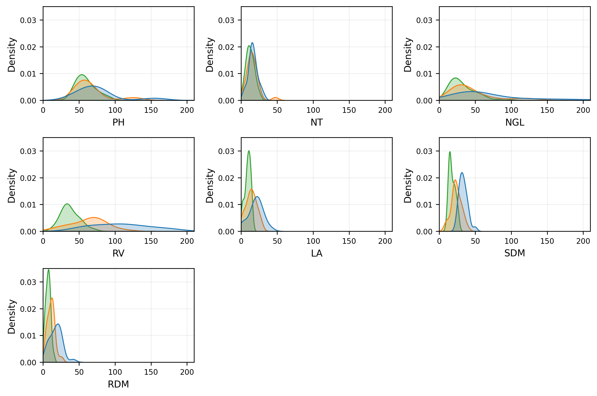

# Classification of Tropical Forage Grass Varieties Under Moderate and Severe Water Stress using Naïve Bayes and Kernel Density Estimation

**Authors:** Bruno Rodrigues de Oliveira, Renato Lustosa Sobrinho, Marco Aparecido Queiroz Duarte

**Abstract:** The selection of forage grasses that are more adapted to adverse conditions, such as water scarcity or dry rain periods, is extremely important. Mainly due to the severe climate changes, and the search for more sustainable ways of farming. Forage grasses form the basis of the diet of beef cattle and are also used as a source of biofuels, for erosion control and soil improvement. This work presents a machine learning methodology to obtain classification models for nine forage cultivars, subject to moderate and severe water stress. The Naïve Bayes algorithm is used together with the Kernel Density Estimation method to obtain the densities used in the classification models. Before learning the models, the grouped cross-validation technique and also the grid search are used to search for the best set of hyperparameters. The best accuracy and precision results are 0.88 and 0.90, respectively. It is observed that the classification performance depends on the cultivars used in the training and test sets. At the end, the estimated probability densities are also analyzed by comparing them with some statistics obtained for each variable and water stress or control environments.

Probability densities obtained for each variable and each class.

